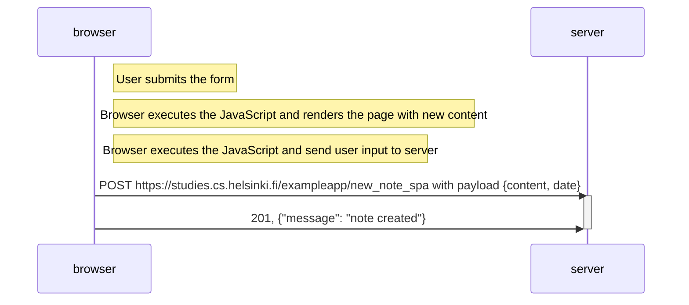

```mermaid
sequenceDiagram

participant browser
participant server

Note right of browser: User submits the form

Note right of browser: Browser executes the JavaScript and renders the page with new content

Note right of browser: Browser executes the JavaScript and send user input to server

browser->>server: POST https://studies.cs.helsinki.fi/exampleapp/new_note_spa with payload {content, date}
activate server
browser->>server: 201, {"message": "note created"}
deactivate server
```
